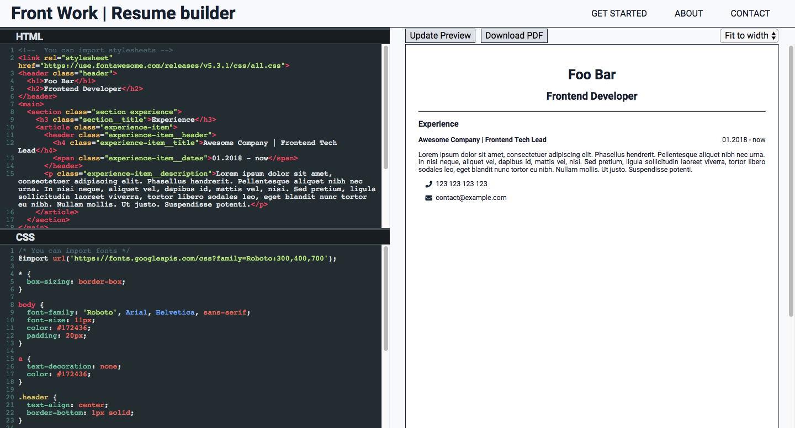

# Front Work Resume Builder

A web application to easily create a pdf file from HTML and CSS with code editors. Build with an intention to use as a resume builder but currently, but can be used to create any sort of .pdf documents.

## Homepage: [https://frontwork.io](https://frontwork.io)

## Development
1. `npm install`
2. `npm start` to start the Express.js server - Backend
3. `npm run webpack-server` to start the web application - Frontend
4. Open [http://localhost:8080](http://localhost:8080)

---
If you would like to contribute please contact me [https://pauljanicki.com](https://pauljanicki.com)